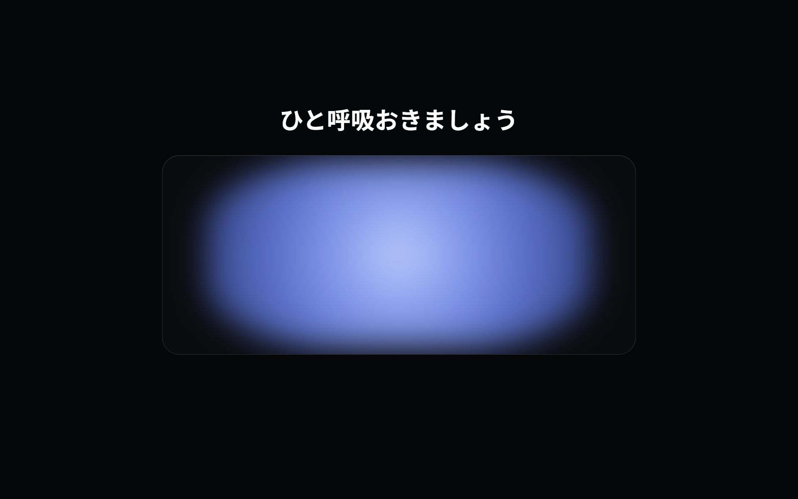
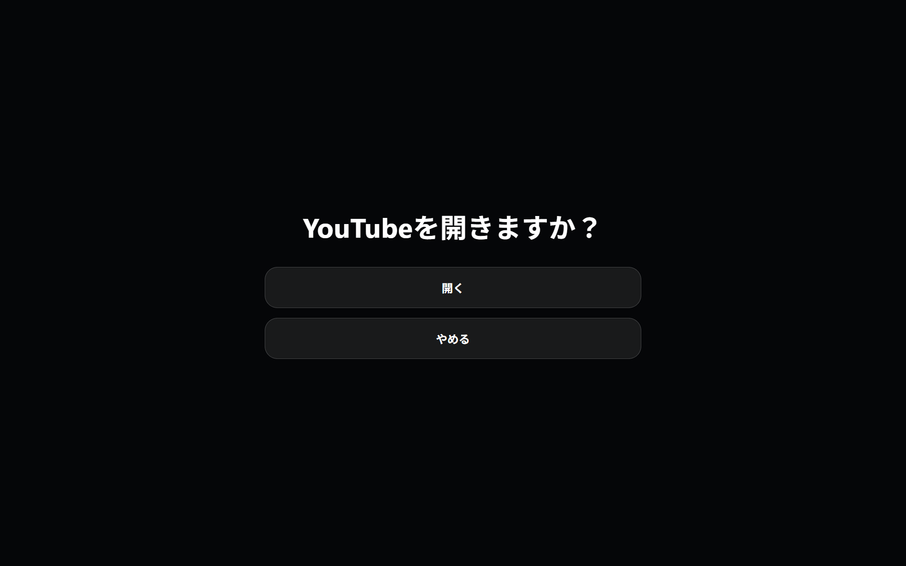
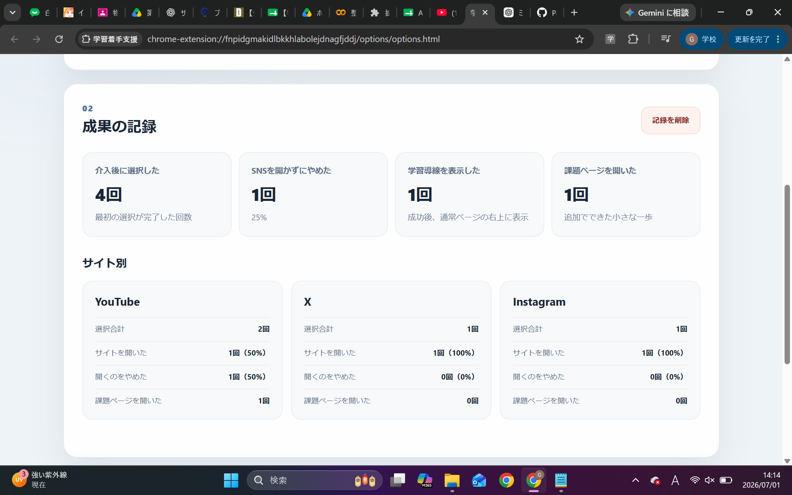

# PauseStep

SNSを開く前にひと呼吸を入れ、利用を続けるか自分で選び直せるようにするChrome拡張機能です。
SNSを開かずにやめられた場合は、その行動を称賛し、任意で課題ページを開くための小さな導線を表示します。

## 概要

YouTube・X・Instagramを開いたときに、10秒間の呼吸画面を表示します。

呼吸画面の後に、

* 開く
* やめる

の2つから選択できます。

「やめる」を選ぶと「流石です！」と表示され、同じ画面の右上に小さく「課題ページを開く」ボタンが表示されます。
課題を始めるかどうかは利用者が自由に選択でき、課題を開かなかった場合も失敗として扱いません。

## スクリーンショット

> `screenshots`フォルダ内の画像名を、下記と同じ名前に変更してください。

### 1. 呼吸画面



### 2. 選択画面



### 3. 記録画面



## 主な機能

* YouTube・X・Instagramを開いたときに介入画面を表示
* 10秒間の呼吸アニメーション
* 「開く」「やめる」の2択
* SNSを開かずにやめた行動への称賛表示
* 任意で課題ページを開ける小さな導線
* 選択結果の端末内保存
* 全体とサイト別の結果表示
* 課題URLの設定
* 記録データの削除

## 対応サイト

* YouTube
* X
* Instagram

## 使い方

1. 対象のSNSを開きます。
2. 10秒間の呼吸画面が表示されます。
3. 「開く」または「やめる」を選択します。
4. 「やめる」を選ぶと「流石です！」と表示されます。
5. 必要な場合は、右上の「課題ページを開く」から学習ページへ移動できます。

## インストール方法

1. このリポジトリをダウンロードします。
2. ZIP形式の場合は解凍します。
3. Chromeで `chrome://extensions/` を開きます。
4. 右上の「デベロッパー モード」をONにします。
5. 「パッケージ化されていない拡張機能を読み込む」を押します。
6. `manifest.json`が入っているフォルダを選択します。
7. Chrome右上の拡張機能一覧からPauseStepを開き、課題ページのURLを登録します。

## 記録画面の開き方

1. Chrome右上の拡張機能アイコンを押します。
2. PauseStepを選択します。
3. 設定・記録画面が開きます。

または、`chrome://extensions/`からPauseStepの「詳細」を開き、「拡張機能のオプション」を選択します。

## 記録するデータ

PauseStepでは、次のデータを記録します。

* 選択した日時
* 対象サイト
* 「開く」「やめる」の選択結果
* 課題ページを開いたかどうか

データは `chrome.storage.local` を使用して端末内に保存されます。
外部サーバーへの送信、アカウント登録、クラウド同期は行いません。

## 技術構成

* HTML
* CSS
* JavaScript
* Chrome Extensions Manifest V3
* `chrome.storage.local`
* Service Worker
* Content Scripts

## ファイル構成

```text
PauseStep/
├─ manifest.json
├─ service-worker.js
├─ content/
│  ├─ intervention.css
│  └─ intervention.js
├─ options/
│  ├─ options.html
│  ├─ options.css
│  └─ options.js
├─ screenshots/
└─ README.md
```

## 研究上の背景

PauseStepは、SNS利用前に一度立ち止まるためのセルフナッジと、利用を中止できた行動への称賛フィードバックを組み合わせた試作システムです。

参考にした研究：

* Grüning, D. J., Riedel, F., & Lorenz-Spreen, P. (2023).
  *Directing smartphone use through the self-nudge app one sec.*
  https://doi.org/10.1073/pnas.2213114120

* 木村航平・藤田欣也（2024）
  「称賛と警告フィードバックのスマートフォン過剰使用抑制意欲への影響の実験的検討」
  https://doi.org/10.11184/his.26.4_419

## このアプリの特徴

既存研究のSNS利用停止支援に加えて、次の点を取り入れています。

* SNSを開かなかった成功を、その場で完結させる
* 課題を強制せず、小さな任意の導線として提示する
* 課題を開かなかったことを失敗として表示しない
* SNS停止と学習着手の両方を記録できる

## 現在の制限

* PC版Google Chromeのみ対応
* 対応サイトはYouTube・X・Instagramのみ
* スマートフォンには未対応
* 学習時間や課題の完了状況は測定しない
* 自己実験向けの試作段階

## 今後の改善案

* 対応サイトを設定画面から変更できる機能
* 呼吸アニメーションの調整
* 評価期間ごとの結果比較
* より少ない負担で学習着手を促す提示方法の検証

## 注意

本アプリは研究・学習目的で制作した試作版です。
利用による行動変化や学習効果を保証するものではありません。
::: 
